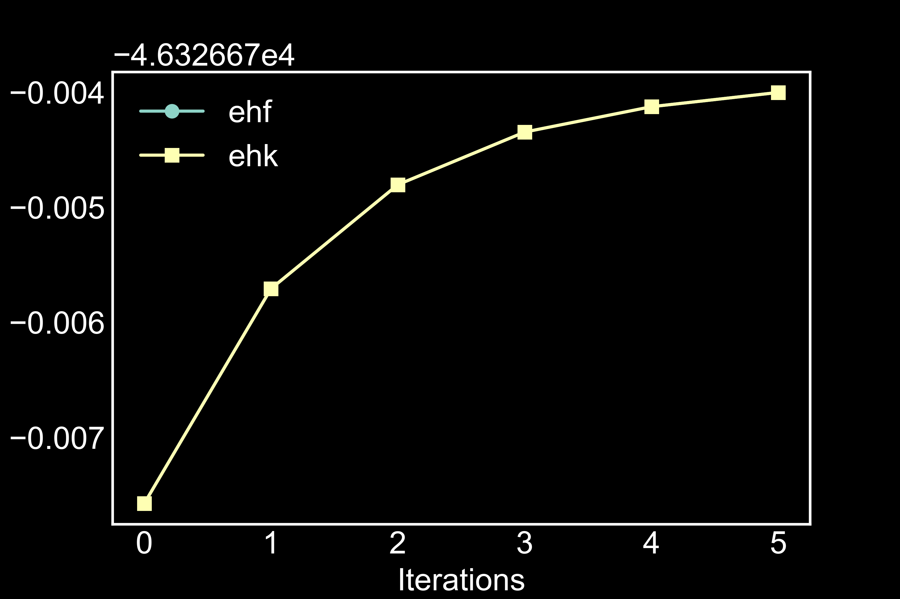

# QUESTAAL READER

Reader for questaal quantum code output

*NOTE: Soon to be combined with [pyquestaal](https://github.com/santoshkumarradha/pyquestaal)*

### Installation and Examples

place the questaal_reader.py file in the python bin and use after installing requirements.txt as
```console
 pip install -U -r requirements.txt
 ```

example usage shown in [example.ipynb](./example.ipynb)


### example usage
Make sure you use high verbosity and ideally --pr51 and pipe lmf output to a file


```python
from questaal_reader import *
output=reader("out") #out is the output file name
ehf=[i.ehf for i in output.iterations]
ehk=[i.ehk for i in output.iterations]
plt.plot(ehf,marker="o",label="ehf")
plt.plot(ehk,marker="s",label="ehk")
plt.ylabel("Energy (eV)")
plt.xlabel("Iterations")
plt.legend()
plt.show()
```

produces the following plot


