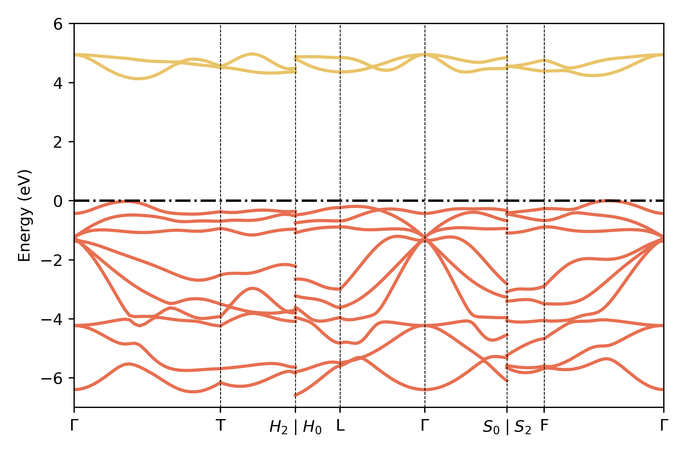

# QUESTAAL READER

Reader for questaal quantum code output

*NOTE: Soon to be combined with [pyquestaal](https://github.com/santoshkumarradha/pyquestaal)*

### Installation and Examples

place the questaal_reader.py file in the python bin and use after installing requirements.txt as
```console
 pip install -U -r requirements.txt
 ```

example usage shown in [example.ipynb](./example.ipynb)


### example usage
Make sure you use high verbosity and ideally --pr51 and pipe lmf output to a file


```python
from questaal_reader import *
output=reader("out") #out is the output file name
ehf=[i.ehf for i in output.iterations]
ehk=[i.ehk for i in output.iterations]
plt.plot(ehf,marker="o",label="ehf")
plt.plot(ehk,marker="s",label="ehk")
plt.ylabel("Energy (eV)")
plt.xlabel("Iterations")
plt.legend()
plt.show()
```

produces the following plot


Returns pymatgen band plotter for easy plotting with bnds.ctrl

```python
from questaal_reader import get_bands
import matplotlib.pyplot as plt
from pymatgen.electronic_structure.plotter import BSPlotter as bp

p=get_bands("./band-data/bnds.temp")

fig,ax=plt.subplots()
for i in range(len(bp(p).bs_plot_data()['distances'])):
    d=bp(p).bs_plot_data()['distances'][i]
    e=bp(p).bs_plot_data()['energy'][i]['1']
    for k in e:
        if k[0]>0:c="#e9c46a"
        else:c="#e76f51"
        plt.plot(d,k,c=c,lw=2)

for j,i in enumerate(bp(p).bs_plot_data()['ticks']["distance"]):
    plt.axvline(i,c="k",ls="--",lw=.5)
ax.set_xticks(bp(p).bs_plot_data()['ticks']["distance"])
ax.set_xticklabels(bp(p).bs_plot_data()['ticks']["label"])
ax.axhline(0,ls="-.",c="k")
plt.ylim(-7,6)
ax.autoscale(enable=True, axis='x', tight=True)
ax.set_ylabel("Energy (eV)")
plt.tight_layout()
plt.savefig("bands.png",dpi=400)
plt.show()
```

produces the following plot
